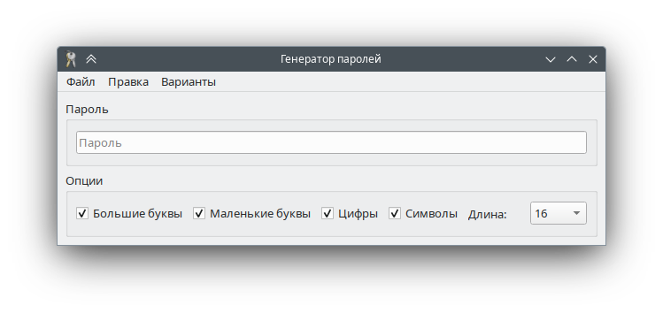

# Password Generator

Simple password generator for desktop platforms like OS X, Linux or Windows.



## Presets

There are several presets called by the corresponding menu item:

|Preset|Upper Case|Lower Case|Digits|Symbols|Length|
|---|---|---|---|---|---|
|Long|X|X|X|X|32|
|Medium|X|X|X|X|16|
|UNIX|X|X|X|X|8|
|PIN| | |X| |4|

## Ambiguous Letters

The following characters that may look confusing depending on font are excluded: 'I', 'l', 'O'.

## Build

Requirements:
* Qt6

**Debug**


```sh
cmake . --preset Debug
cmake --build --preset Debug --target password_generator
```

**Release**


```sh
cmake . --preset Release
cmake --build --preset Release --target password_generator
```
