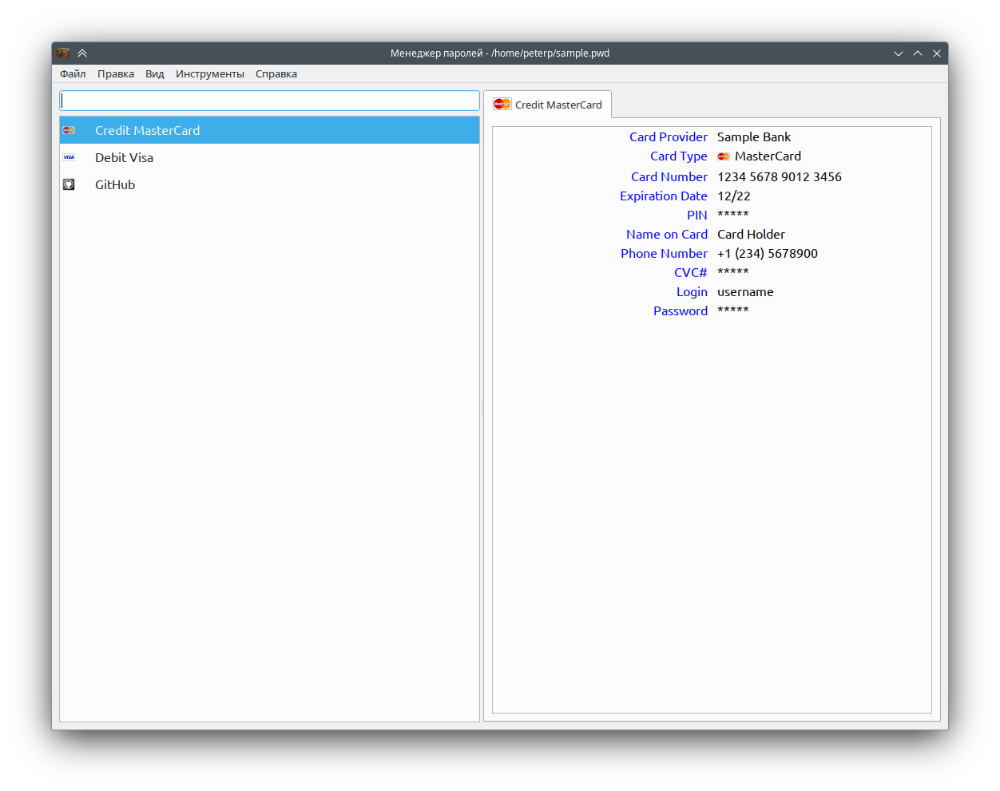

# Password Manager

Приложение для хранения паролей, кредитных карт и другой секретной информации. Для шифрования используется AES-256.

## Соображения по безопасности

Приложение обеспечивает безопасность данных исключительно посредством шифрования файла.

Приложение не предпринимает никаких усилий по предотращению атак на учетную запись пользователя в системе, аппаратуру и пр.
